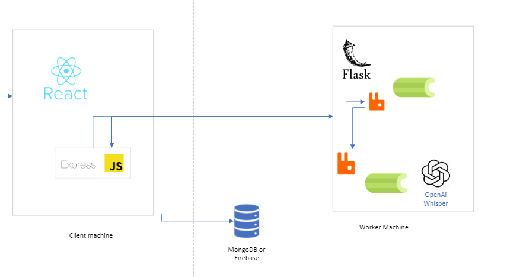

# Project Structure


## Directory Structure of the Engine

### This Engine runs on Flask, Celery, and Redis.

In order to be modular, we use [Flask Blueprints](https://flask.palletsprojects.com/en/3.0.x/blueprints/#) to organize our code. 

```bash
C: ClassifAI-engine
├───.github
│   └───workflows # Github Actions for CI/CD. Includes automated testing and deployment.
├───docs # Folder for documentation. Uses mkdocs.
│   ├───assets
│   ├───contribution
│   └─── # Documentation files. See docs/contribution/editing_docs.md for more information.
└───src
    ├───app.py # main file, this imports the services and runs the engine
    ├───utils # services that the engine provides. 
        ├───transcription # Contains the transcription service
        ├───classification # Contains the classification service
        └───summarize # Contains the summarization service
    ├───endpoints # Contains the API endpoints for the engine
    ├───config # settings for the engine (development, production, etc.)
    ├───requirements.txt and requirements-dev.txt # Python dependencies
    └───tests # Test suite
```

## Structure of the 'services' folder

```bash
C: services
├───transcription # Contains the transcription service
│   ├───views.py # Contains the API for the transcription service (endpoints)
│   ├───tasks.py # Config for task queueing of the transcription service (Celery)
│   └───validate.py # Validates the input for the transcription service
├─── classification # Contains the classification service
│   ├───views.py # Contains the API for the classification service (endpoints)
│   ├─── # TODO: Add Utils
│   └─── # TODO: Add Tasks and Validation
├───sentiment # Contains the sentiment service
│   ├───views.py # Contains the API for the sentiment service (endpoints)
│   ├───tasks # Contains the tasks for the sentiment service
│   └───utils # Contains the utils for the sentiment service
├───summarize # Contains the summarization service
│   ├───views.py # Contains the API for the summarization service (endpoints)
│   ├───validate.py # Validates the input for the summarization service
│   └───utils.py # Contains the utils for the summarization service
```

## Other Files

There are also a few other files that are not included in the above tree. These are:

* .pre-commit-config.yaml - Configuration for pre-commit hooks
* mkdocs.yml - Configuration for mkdocs (documentation)
* Dockerfile - Dockerfile for building the engine # TODO: Add Dockerfile
* .gitignore - Files to ignore in git

## Engine Architecture

The engine is built using Flask, Celery, and Redis. The engine is deployed using Docker and Docker Compose.

There are two main components of the engine: the API and the worker. The API is the main entry point for the engine. It is responsible for handling requests and sending them to the worker. The worker is responsible for processing the requests. The worker is also responsible for sending the results back to the API.

The API and the worker are connected using Redis. Redis is a key-value store that is used as a message broker. The API and the worker communicate using Redis queues. The API pushes requests to the queue and the worker pops requests from the queue. The worker then processes the request and pushes the results to the queue. The API then pops the results from the queue and sends them back to the user.

## Engine Connection to the Client Machine (ClassifAI Portal)




The engine functions as a RESTful API. The API is the main entry point for the engine. The API is responsible for handling requests and sending them to the worker. The worker is responsible for processing the requests. The worker is also responsible for sending the results back to the API.

* Both the client and engine share a database. This is so we are not passing over entire audio files to the engine. Instead, we pass over the file path to the audio file. The engine then reads the file from the database. This is more efficient than passing over the entire audio file.

For expectations of the API, check out the [API Documentation](api/api.md).